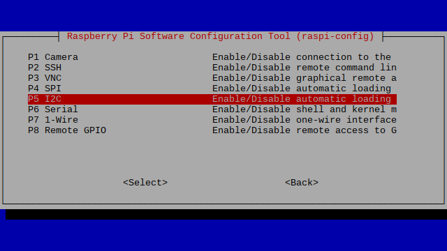

# RaspberryPi-20x4-LCD

This is a python program for accessing a LCD (20 x 4 Chars) over a raspberry pi, using a discord client bot. 

This project was tested on a Raspberry Pi 3B V1.2 running Raspberry Pi OS.
First of all you are wiring the outputs (GND, VCC, SDA, SCL) to the correct pinouts of the raspberry pi.

After you did that you need to go to the Raspi-Config tool to enable I2C, so we can access the lcd over our pins. Enter following command in your terminal:

Terminal $: 
  sudo raspi-config
  
Go from there then to Interface Options, then to I2C and enable it by selecting Yes.

Now it is set up! We use python librarys like RPLCD and Discord to run the final product. RPLCD is used for printing on the lcd and discord for reading input messages of the discord bot. 

Terminal $: 
  sudo pip install RPLCD discord
  
The end result is seen here:
